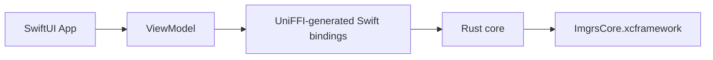
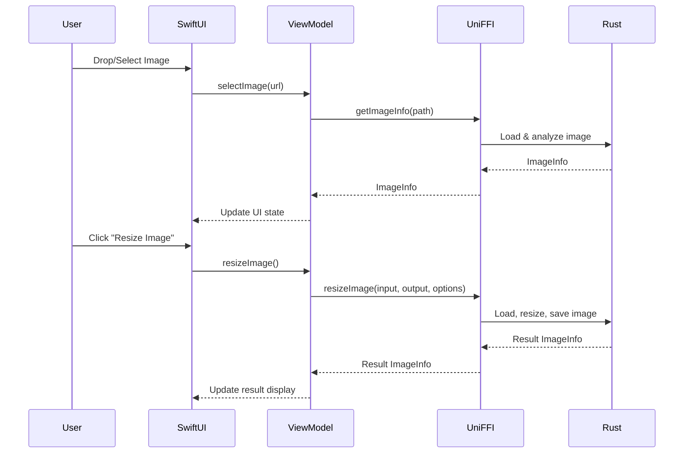

# ImageResizer

macOS app for resizing images using a Rust core library exposed to Swift via UniFFI.

## Project Overview



| Component | Tech |
| --- | --- |
| Core processing | Rust 1.85+ |
| FFI + bindings | UniFFI 0.29.4 |
| UI | SwiftUI (Swift 6.0+) |
| IDE / build | Xcode 16.2+ |
| Deployment target | macOS 14.0+ |

## Prerequisites

- Rust toolchain (`rustup`, `cargo`, `rustc`)
- Xcode 16.2+
- macOS Sequoia 15.2+ for development
- Rust targets:

```bash
rustup target add aarch64-apple-darwin x86_64-apple-darwin
```

## Setup on a New Mac (After Cloning)

The `ImgrsCore.xcframework` is **not** included in the repository (it's in `.gitignore`). To get the project working:

1. Clone the repository:

```bash
git clone https://github.com/MelloBirkan/ImageResizer.git
cd ImageResizer
```

2. Build the Rust framework (generates `ImgrsCore.xcframework`):

```bash
./scripts/build-rust.sh
```

3. Open in Xcode and run:

```bash
open ImageResizer.xcodeproj
```

The framework will be generated automatically in the first step. The Xcode project is already configured to use it.

## Project Structure

```
.
├── ImageResizer/               # SwiftUI app sources
├── ImageResizer.xcodeproj/     # Xcode project
├── ImgrsCore.xcframework/      # Built XCFramework (Rust core)
├── rust-core/                  # Rust library + UniFFI scaffolding
├── scripts/                    # Build/clean scripts
└── swift-bindings/             # Generated Swift bindings
```

## Build Instructions

### Building the Rust Library

```bash
cd /path/to/ImageResizer
./scripts/build-rust.sh
```

What the script does:

- Builds the Rust library for both Apple Silicon and Intel architectures
- Generates Swift bindings using UniFFI
- Creates a universal binary with `lipo`
- Packages everything into an XCFramework

### Building the macOS App

- Open `ImageResizer.xcodeproj` in Xcode
- Select the `ImageResizer` scheme
- Build and run (⌘R)

Or build from the command line:

```bash
xcodebuild -project ImageResizer.xcodeproj -scheme ImageResizer -configuration Release build
```

## Xcode Integration

This repo is already configured; the notes below are for reference.

### XCFramework Integration

- XCFramework location: `ImgrsCore.xcframework`
- Added to the Xcode project and linked in the Frameworks phase
- Embedded in the app bundle automatically

### Swift Bindings Integration

- Swift bindings live in `swift-bindings/`
- Added as a file system synchronized group in Xcode
- Automatically compiled with the app
- Import with `import imgrs_core` (module name from generated bindings)

### Build Settings

- Deployment target: macOS 14.0
- Swift version: 5.0 (Swift 6 language mode enabled via flags)
- Code signing: Automatic (update `DEVELOPMENT_TEAM` if needed)

## Usage Guide

### Application Features

- Drag & drop images or use file picker
- Supported formats: PNG, JPEG, WebP, GIF, BMP, TIFF
- Resize algorithms: Nearest (fastest), Bilinear (balanced), Lanczos3 (highest quality)
- Maintain aspect ratio or specify custom dimensions
- Choose output format or keep original
- Preview original and resized image information

### Using the Rust Core Library

```swift
import Foundation

// Get image information
let info = try getImageInfo(path: "/path/to/image.png")
print("Dimensions: \(info.width) × \(info.height)")

// Resize image
let options = ResizeOptions(
    width: 800,
    height: nil,  // nil maintains aspect ratio
    algorithm: .lanczos3,
    outputFormat: nil  // nil keeps original format
)
let result = try resizeImage(
    inputPath: "/path/to/input.png",
    outputPath: "/path/to/output.png",
    options: options
)

// Get supported formats
let formats = getSupportedFormats()
```

## Troubleshooting

### Build Errors

- **"UniFFI contract version mismatch"**: Clean build folder and rebuild Rust library with `./scripts/clean.sh && ./scripts/build-rust.sh`
- **"Module 'imgrs_coreFFI' not found"**: Ensure the XCFramework is properly linked in the Xcode project
- **Rust build fails**: Verify Rust toolchain is installed and targets are added

### Runtime Errors

- `ImageError.IoError`: Check file paths and permissions
- `ImageError.UnsupportedFormat`: Verify image format is in supported list
- `ImageError.InvalidDimensions`: Ensure dimensions are between 1 and 9999

### Performance Tips

- Use `.nearest` for fastest processing
- Use `.lanczos3` for best quality (slower)
- Large images may take several seconds to process

## Development

### Modifying Rust Core

- Edit `rust-core/src/lib.rs`
- Rebuild with `./scripts/build-rust.sh`
- Xcode will pick up changes on next build

### Modifying SwiftUI

- Edit files in `ImageResizer/`
- Views: `ImageResizer/Views/`
- ViewModel: `ImageResizer/ViewModels/`
- Build and run in Xcode

### Cleaning Build Artifacts

```bash
./scripts/clean.sh
```

## Architecture Details



### Data Flow

- User interactions captured by SwiftUI views
- ViewModel manages state and business logic
- UniFFI-generated bindings provide type-safe Rust function calls
- Rust core performs image processing
- Results flow back through the same chain

## License and Credits

- License: (add your preferred license)
- Libraries: `image`, `fast_image_resize`, `uniffi`, SwiftUI

## Additional Notes

- App is sandboxed with read-only file access enabled
- Requires user permission to access selected files
- Universal binary supports both Apple Silicon and Intel Macs
- Minimum deployment target: macOS 14.0 (Sonoma)
